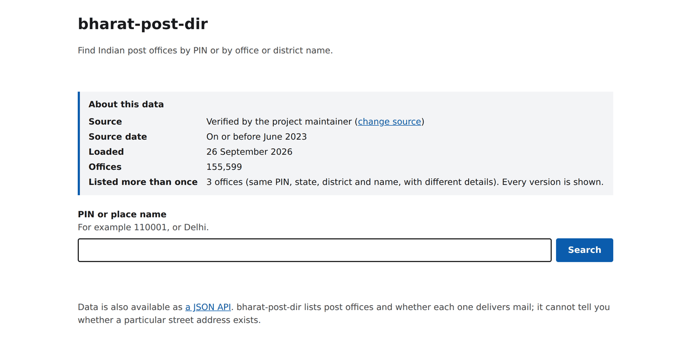
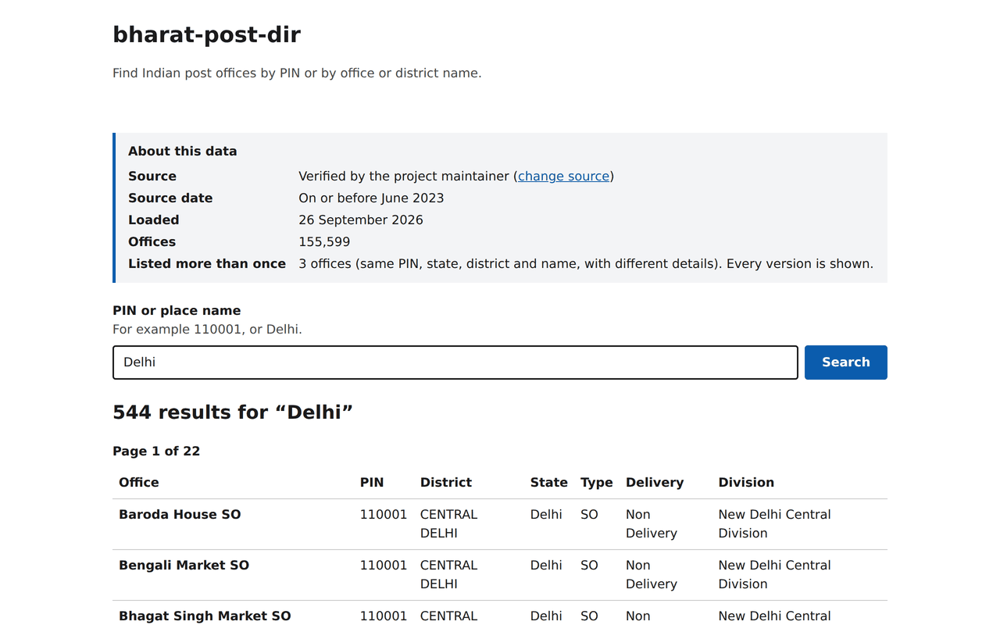
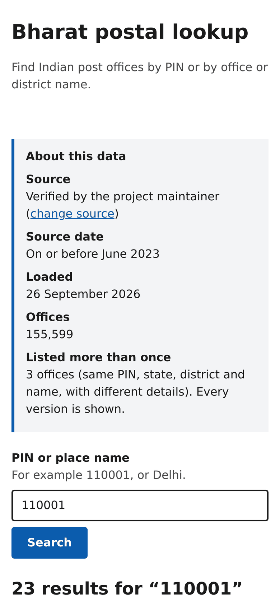

A helper that tells you which India Post offices sit behind a PIN code or place name, ready to drop into your own applications as a JSON API or a Docker image. Read the [project write-up](http://localhost:3000/projects/bharat-post-dir) for background.

[](https://github.com/code-kasha/bharat-post-dir/actions/workflows/ci.yml)
[](LICENSE)
[](https://www.python.org/)
[](https://docs.djangoproject.com/en/5.2/)

[API reference](docs/api.md) · [Download the whole directory](docs/api.md#the-whole-directory-in-one-download) · [Your own dataset](docs/datasets.md) · [Deploy it yourself](docs/deployment.md) · [Contributing](CONTRIBUTING.md)

<picture>
  <source media="(prefers-color-scheme: dark)" srcset="docs/images/home-dark.png">
  
</picture>

- **155,599 offices bundled**; it works right after cloning.
- **Accessible lookup page**: one request per page, no JavaScript.
- **JSON API** with OpenAPI docs.
- **The whole directory in one download** (1.4 MB gzipped) that is never resent unchanged.
- **Every page shows where the data came from** and how current it is.
- **Bring your own dataset** (CSV or JSON) and share it back.
- **Ready-to-run Docker image** for your own deployment; SQLite, no external services.

> **Status:** complete as of v1.0.0 and not actively maintained. It works as-is; fork it, reuse it, grow it.

## Quick start

Install [Git](https://git-scm.com/downloads), then clone the repository. The clone includes `db.sqlite3` (about 28 MB) with the whole directory, and every command below runs from its folder:

```sh
git clone https://github.com/code-kasha/bharat-post-dir.git
cd bharat-post-dir
```

**With Python.** Requires Python 3.13 and [uv](https://docs.astral.sh/uv/):

```sh
uv sync --frozen
uv run python manage.py migrate
uv run python manage.py runserver
```

Then open the [lookup page](http://127.0.0.1:8000/), the [API documentation](http://127.0.0.1:8000/api/docs/) or [a PIN lookup in JSON](http://127.0.0.1:8000/api/v1/pincodes/110001/).

**With Docker.** These commands are the same in bash, zsh, PowerShell, cmd and Git Bash:

```sh
docker build -t bharat-post-dir:local .
docker run -d --rm --name app-demo -p 127.0.0.1:18000:8000 bharat-post-dir:local
```

Then open [127.0.0.1:18000](http://127.0.0.1:18000/). Run `docker stop app-demo` when finished. New to Docker on Windows? See [docs/docker-windows.md](docs/docker-windows.md).

Both run in **production mode** by default: no debug pages, and a random secret key created once next to the database. **Contributor mode** is opt-in with `DJANGO_DEBUG=true`; it shows Django's debug pages and saves uploaded datasets so you can share them.

| Shell | Contributor mode |
| --- | --- |
| bash, zsh, Git Bash | `DJANGO_DEBUG=true uv run python manage.py runserver` |
| PowerShell | `$env:DJANGO_DEBUG = "true"`, then `uv run python manage.py runserver` |
| cmd | `set DJANGO_DEBUG=true`, then `uv run python manage.py runserver` |

## Using it

### The lookup page

`/` is a server-rendered search page. Enter a 6-digit PIN or at least 2 characters of an office or district name. Every page shows the data's source, its source date (exact, approximate such as "On or before June 2023", or "not recorded"), when it was loaded and how many offices it has.



Each search, results page or error costs **one HTTP request**: the CSS is inline, and there is no JavaScript, web font, image or external asset. Each lookup uses three database queries. The page is built for keyboard and screen-reader use: a skip link, a labelled search box with its hint and errors linked through `aria-describedby` and `aria-invalid`, "Error:" in the page title when input is rejected, captioned result tables with row and column headers, visible focus outlines, light and dark colour schemes, and a layout that stacks on phones.



### The API

All endpoints are read-only and public; no key or account is needed. Lists are paginated, 25 per page.

```sh
curl http://127.0.0.1:8000/api/v1/pincodes/110001/
curl "http://127.0.0.1:8000/api/v1/offices/?search=market&state=Delhi"
curl http://127.0.0.1:8000/api/v1/states/
curl http://127.0.0.1:8000/api/v1/dataset/
```

A PIN is a six-character string and can map to many offices: `110001` returns 23. The [API reference](docs/api.md) lists every endpoint, filter and field, and `/api/docs/` is the interactive documentation.

### The whole directory

`/api/v1/export/` returns every office and the dataset's details in one streamed JSON file. It is 1.4 MB gzipped (42.9 MB uncompressed), named after its source date and SHA256, and its ETag means an unchanged directory is never downloaded twice:

```sh
curl -OJ --compressed http://127.0.0.1:8000/api/v1/export/
```

Without a running server, `uv run python manage.py export_directory` writes the same file, gzipped. Each release also attaches it, with `db.sqlite3` and their SHA256 sums.

## Use it in your application

- **Call the API** from any language: it is plain JSON over HTTP with an OpenAPI schema at `/api/schema/`, so you can generate a client.
- **Run the Docker image** next to your application. It bundles the directory, applies its migrations on start, and needs no database server or other service.
- **Take the export** if you only need the data: one JSON file with every office, to load into your own database or ship with your application.

## Your own dataset

On a local clone, the **change source** link on the home page lets you load your own CSV or JSON file: the official CSV layout, a data.gov.in API response, a list of offices, or bharat-post-dir's own export. The whole file is validated before anything changes. In the default mode an upload is temporary and only your browser sees it; in contributor mode it replaces `db.sqlite3`, and the page shows how to share it back as a pull request or a published fork.

The change-source page has no login, so it is off in the Docker image and must stay off on any hosted site. To use your own dataset, run bharat-post-dir locally or deploy it yourself. The details are in [docs/datasets.md](docs/datasets.md), which also covers fetching the official directory from data.gov.in with `fetch_postal_data`.

## The data

The bundled directory is the project's 2023 snapshot, verified by the project maintainer: 155,599 offices, with a source date of on or before June 2023. Each office has its PIN, name, type (head, sub or branch office), whether it delivers mail, district, state, and India Post circle, region and division. Known quirks:

- It has no coordinates. Datasets that have them may include points outside India, so treat coordinates as approximate.
- 3 offices are listed twice with different details. Both versions are kept, because government data can list an office twice legitimately.
- Its original upstream source and license were not recorded in 2023.
- It lists post offices and whether each one delivers mail. It cannot tell you whether a particular street address exists.

Every page and `/api/v1/dataset/` show the source, source date, load time, SHA256 and counts of the current data; bharat-post-dir never invents a date. See [docs/datasets.md](docs/datasets.md) for the fields and provenance rules.

## Deploy it yourself

Run the Docker image as one container with a persistent `/data` volume behind a TLS reverse proxy. [docs/deployment.md](docs/deployment.md) walks through it with Caddy, and covers the settings, backups, updates and rollback. The steps were verified end to end on 26 September 2026 in a Linux sandbox, with a local certificate in place of a real domain.

bharat-post-dir uses Django 5.2 LTS, whose security support ends in April 2028. A fork should upgrade Django before running it publicly after that.

## For developers

```text
config/                 settings, URL routing, WSGI entrypoint
postal/models.py        dataset metadata and indexed office records
postal/importer.py      fetching, CSV and JSON parsing, validation, atomic replacement
postal/uploads.py       temporary per-browser uploads
postal/queries.py       PIN and search rules shared by the API and the lookup page
postal/serializers.py   API fields and query validation
postal/views.py         the read-only API
postal/export.py        the streamed, versioned whole-directory download
postal/web.py           the lookup and change-source pages (templates in postal/templates/)
postal/management/      the fetch_postal_data command
tests/                  synthetic fixtures; tests never reach the network
```

The main checks, which CI also runs on every push and pull request along with a Docker build:

```sh
uv sync --frozen
uv run ruff check . && uv run ruff format --check .
uv run pytest
uv run python manage.py makemigrations --check --dry-run
uv run python manage.py spectacular --validate --fail-on-warn --file schema.yml
```

[`AGENTS.md`](AGENTS.md) lists the rules the code keeps. [docs/performance.md](docs/performance.md) has measured response times, and [docs/deployment.md](docs/deployment.md#configuration) every setting.

## Where this could go

bharat-post-dir is finished, but there is plenty of room for whoever picks it up:

- **Monthly auto-refresh** from data.gov.in once its sign-up works again (it was broken on 26 September 2026), with a changelog of what changed in the data.
- **A static JSON API** on GitHub Pages or a CDN: one file per PIN, no server at all.
- **Lookup packages** for npm and PyPI that bundle the directory.
- **A data quality report** for each release: offices without coordinates, points outside India, repeated offices.
- **Resolving the bundled data's origin and license**, or replacing it with an official download.

## Contributing, license and credit

bharat-post-dir is complete as of v1.0.0 and not actively maintained: issues and pull requests may go unanswered, so fork it freely. The code is under the [MIT License](LICENSE) with no extra conditions. Data fetched from data.gov.in is published under the Government Open Data License – India; keep its attribution requirements.

If you update the dataset, please share it back, with a pull request or by publishing your fork; [`CONTRIBUTING.md`](CONTRIBUTING.md) explains how. A mention is appreciated, never required.

Created by Akash Damle ([@code-kasha](https://github.com/code-kasha)).
