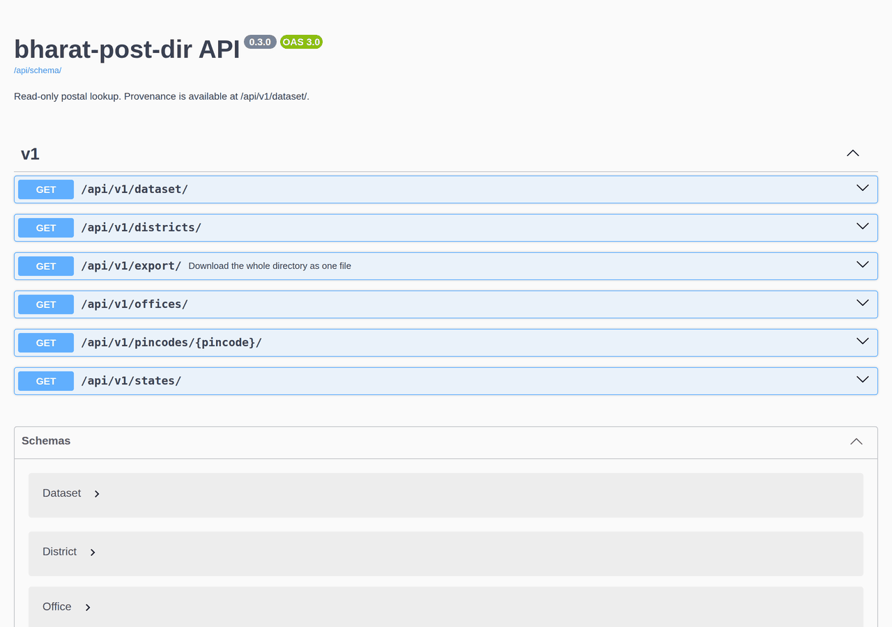

# API

All data endpoints are read-only and public, with no key or account. Writes happen only through the importer, via `fetch_postal_data` or the local [change-source page](datasets.md#your-own-dataset). The interactive documentation is at `/api/docs/`, and the OpenAPI schema at `/api/schema/`.



## Endpoints

| Endpoint | Behavior |
| --- | --- |
| `GET /api/v1/pincodes/110001/` | Matching offices, paginated; a malformed PIN is 400, an absent PIN is 404 |
| `GET /api/v1/offices/?search=market` | Search office names and districts |
| `GET /api/v1/offices/?state=Delhi&district=New%20Delhi` | Case-insensitive exact filters; combine with search or pincode |
| `GET /api/v1/states/` | States with their office counts |
| `GET /api/v1/districts/?state=Delhi` | Districts with office counts; `state` is optional and case-insensitive |
| `GET /api/v1/dataset/` | Source, source date or period, SHA256, import timestamp and counts; 404 before the first import |
| `GET /api/v1/export/` | The whole directory as one JSON file in one request; see [below](#the-whole-directory-in-one-download) |
| `GET /api/schema/` | Generated OpenAPI schema |
| `GET /api/docs/` | Interactive Swagger documentation (Swagger UI 5.33.0, loaded from jsDelivr) |
| `GET /health/` | Process and database connectivity, with the running `version` and `revision` (commit); does not assert dataset freshness |

```sh
curl http://127.0.0.1:8000/api/v1/pincodes/110001/
curl "http://127.0.0.1:8000/api/v1/offices/?search=market&state=Delhi"
curl http://127.0.0.1:8000/api/v1/dataset/
```

## Responses

Lists return `count`, `next`, `previous` and `results`, with 25 items per page. Follow `next` to retrieve further matches. Search requires 2–100 characters. An empty list is valid when filters match nothing or before the first import.

```json
{
  "count": 1,
  "next": null,
  "previous": null,
  "results": [
    {
      "pincode": "400001",
      "office_name": "Example Office",
      "district": "Example District",
      "state": "Example State",
      "circle": "Example Circle",
      "region": "Example Region",
      "division": "Example Division",
      "office_type": "HO",
      "delivery": "Delivery",
      "latitude": 18.93,
      "longitude": 72.83
    }
  ]
}
```

The office above shows the response shape; its values are illustrative. A PIN is always a six-character string and can map to many offices. `latitude` and `longitude` are passed through as published: they are `null` when the source value is missing or not a valid coordinate, and the upstream data is known to contain some points outside India, so treat them as approximate. Database IDs are deliberately not exposed as stable public identifiers.

`/api/v1/dataset/` describes the current directory:

```json
{
  "source": "Verified by the project maintainer",
  "source_date": null,
  "source_period": "On or before June 2023",
  "checksum": "959693b760df2febd162578011328b4ceabffacb6f2396dfa191ce745334c7d1",
  "imported_at": "2026-09-26T04:49:38.422892Z",
  "row_count": 155599,
  "duplicate_count": 0,
  "repeated_identity_count": 3
}
```

`duplicate_count` is the number of exact repeated rows merged on import; `repeated_identity_count` is the number of offices listed more than once with different details, all of which are kept.

## The whole directory in one download

`GET /api/v1/export/` returns the dataset metadata and every office in a single streamed JSON document, `{"dataset": {...}, "offices": [...]}`. Offices have the same fields as the list endpoints. There is no pagination, so one request downloads everything:

```sh
curl -OJ --compressed http://127.0.0.1:8000/api/v1/export/
```

- **Versioned:** the file is named `post-offices-<source date or "undated">-<first 12 characters of the SHA256>.json`, and the response ETag is the full dataset SHA256.
- **Compressed:** clients that send `Accept-Encoding: gzip` (browsers, `curl --compressed`) receive 1.4 MB instead of 42.9 MB for the bundled directory.
- **Not resent:** a client that sends its ETag back in `If-None-Match` gets `304 Not Modified` with no body until the dataset changes.
- **Streamed:** the server reads offices in batches of 5,000 and never holds the whole directory in memory.

`uv run python manage.py export_directory --output-dir .` writes the same document to a gzipped file without a web server, byte-identical for the same dataset. The download can be uploaded again as a dataset, and it carries its own source and date; see [Your own dataset](datasets.md#your-own-dataset).
