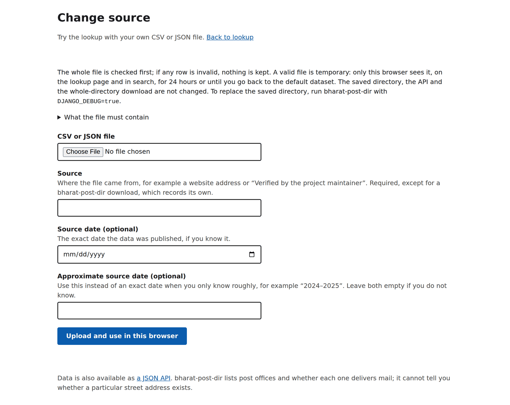
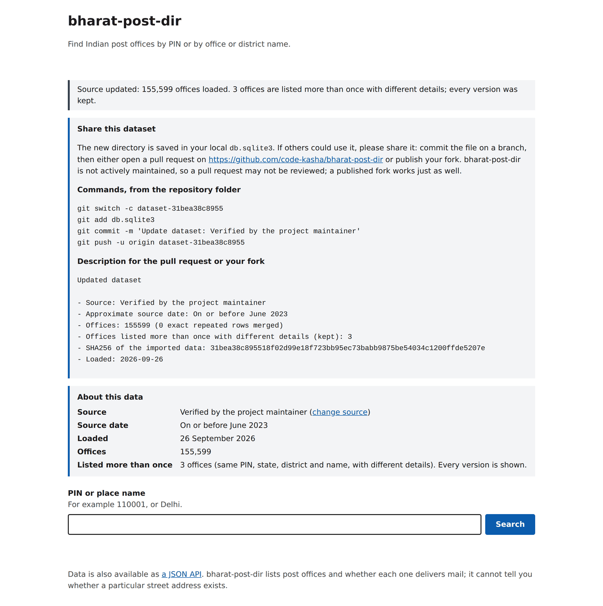

# Datasets

bharat-post-dir serves one directory snapshot at a time, and every page and API response can say where it came from. This page covers the bundled data, bringing your own, and fetching the official directory.

## The bundled directory

The repository ships `db.sqlite3` (about 28 MB) with 155,599 offices from the project's 2023 snapshot, verified by the project maintainer.

- **Source date:** on or before June 2023. The file was committed to this repository on 28 June 2023; its exact publication date was not recorded, so the pages say "On or before June 2023" rather than inventing one.
- **Coordinates:** none. `latitude` and `longitude` are `null` for every office.
- **Repeated offices:** 3 offices are listed twice with different details (same PIN, state, district and office name). Both versions are kept as published.
- **Origin and license:** the snapshot's original upstream source and license were not recorded when it was committed.

Only this `db.sqlite3` is tracked; other databases and SQLite's `-wal` and `-shm` files are gitignored. Committing a refreshed `db.sqlite3` adds its full size to the Git history each time.

## Fields

| Field | Meaning |
| --- | --- |
| `pincode` | Six-digit PIN as a string; never starts with 0. One PIN can map to many offices |
| `office_name` | Post office name, for example `Baroda House SO` |
| `office_type` | `HO` (head office), `SO` (sub office) or `BO` (branch office), as published; the bundled data has 811, 24,556 and 130,232 |
| `delivery` | `Delivery` or `Non Delivery` |
| `district`, `state` | As published; in the bundled data, 92% of district names are upper case |
| `circle`, `region`, `division` | India Post's administrative units; `region` is the only field an import allows to be empty |
| `latitude`, `longitude` | As published, or `null` when missing or invalid; some upstream points lie outside India |

bharat-post-dir lists post offices and whether each one delivers mail. It cannot tell you whether a particular street address exists. Place search is substring matching on office and district names, not fuzzy search.

## Your own dataset

On a local clone you can try or replace the directory with your own CSV or JSON file from the browser. Follow **change source** on the home page, or open [`/source/`](http://127.0.0.1:8000/source/). Choose the file, say where it came from, and optionally give either an exact source date or an approximate one such as "2024–2025". Leave both empty if you do not know; bharat-post-dir never guesses a date.



The format is detected from the file's content, not its name:

- **CSV** uses the directory's column layout: `Circle Name`, `Region Name`, `Division Name`, `Office Name`, `Pincode`, `OfficeType`, `Delivery`, `District` and `StateName`, in any order. Spaces, underscores and case in column names are ignored. `Latitude` and `Longitude` are optional; other columns are ignored.
- **JSON** can be bharat-post-dir's own [whole-directory download](api.md#the-whole-directory-in-one-download) (`{"dataset": ..., "offices": [...]}`), a data.gov.in API response (`{"records": [...]}`), or a plain list of offices. Offices use the CSV column names or bharat-post-dir's field names (`office_name`, `pincode`, `state`, `circle`, `region`, `division`, `office_type`, `delivery`, `district`, `latitude`, `longitude`). A downloaded export records its own source and date, which fill in the form fields you leave empty; anything you type wins.

Either way the file must be UTF-8 (Excel's "CSV UTF-8") and at most 100 MB.

### Validation

The upload goes through the same importer as `fetch_postal_data`, and the whole file is validated before anything is written. Any invalid row rejects the file: the page lists up to 10 problems by CSV line number or JSON record number, and nothing is kept.

- PINs must be six digits that do not start with 0, and every field except `region` must be filled in. A file with no offices is refused.
- Exact repeated rows are merged, and counted.
- An office listed more than once with different details (same PIN, state, district and office name, compared case-insensitively) is kept in every version, because government data can list an office twice legitimately. The page, `/api/v1/dataset/` (`repeated_identity_count`) and the upload result say how many there are.
- The recorded SHA256 is the uploaded file's own, so you can check it with any SHA256 tool.

### Temporary or saved

What happens to a valid file depends on the mode:

- **Default (production) mode: temporary.** The upload is stored in its own scratch SQLite file under `.uploads/` next to the database, named by a signed, HTTP-only cookie. Only that browser sees it, on the lookup page and in search; the API, the export and `db.sqlite3` keep the default dataset. The data panel shows the upload's details and when it will be deleted (after 24 hours), with a **Back to the default dataset** button. A new upload replaces the browser's previous one, and at most 5 uploads are kept at once; the oldest is deleted first.
- **Contributor mode (`DJANGO_DEBUG=true`): saved.** A valid file replaces every office and the source details in `db.sqlite3` (or whatever `SQLITE_PATH` names) in one transaction, and the write-ahead log is folded into the file so it can be committed as-is. To go back to the bundled data, run `git restore db.sqlite3`.

The change-source page has no login, so it is for local use. It is on by default when you run from a clone. A hosted site must set `SITE_ALLOW_SOURCE_CHANGE=false`; the Docker image, which is meant for hosting, already does. When it is off, `/source/` returns 404 and the link is hidden. To use your own dataset, run bharat-post-dir locally or [deploy it yourself](deployment.md). The forms are protected by Django's CSRF check.

### Sharing it back

After a saved upload, the page shows a **Share this dataset** note: the git commands to commit `db.sqlite3` on a branch, and a ready-made description (source, source date or period, office counts and SHA256) for a pull request on this repository or for your own published fork. Pull requests may not be reviewed, so publishing your fork is just as good. See [`CONTRIBUTING.md`](../CONTRIBUTING.md).



## Fetching the official directory

`fetch_postal_data` replaces the directory with the Department of Posts' [All India Pincode Directory](https://www.data.gov.in/resource/all-india-pincode-directory-till-last-month) from data.gov.in. It needs a free API key: sign in at [data.gov.in](https://www.data.gov.in/) and copy it from your account's API key page. The public sample key is capped at 10 records, so it cannot load the directory.

> **Known blocker (checked 26 September 2026):** data.gov.in's sign-up form does not display its captcha, so new accounts cannot be created and no API key can be issued. Until the portal is fixed, the fetch cannot run; use the bundled 2023 snapshot or upload your own file. An existing key should still work, but no live fetch has been run yet.

Set the key in your shell, then run the command:

| Shell | Set the key |
| --- | --- |
| bash, zsh, Git Bash | `export DATA_GOV_IN_API_KEY=your-key` |
| PowerShell | `$env:DATA_GOV_IN_API_KEY = "your-key"` |
| cmd | `set DATA_GOV_IN_API_KEY=your-key` |

```sh
uv run python manage.py fetch_postal_data --dry-run
uv run python manage.py fetch_postal_data
```

The command reads the key only from `DATA_GOV_IN_API_KEY`, never from a command-line argument, so it does not appear in process listings. It pages through the API (`--page-size`, default 1000) and retries transient gateway errors. It refuses a download that is shorter than the total the API reports. `--resource` selects another OGD resource ID with the same fields.

The importer validates the complete download before writing, with the same rules as uploads. A failed fetch leaves the current directory untouched; a successful one replaces the entire directory and its metadata in one transaction. Repeating a fetch that returns identical data is a no-op.

Provenance is recorded from the source itself. The source is the API resource URL (never the key). The source date is the API's reported `updated_date`, left empty if the API does not report one. The SHA256 covers the downloaded records. Upstream updates the directory roughly monthly; refresh by re-running the command, for example from a scheduled job.

Data fetched from data.gov.in is published under the Government Open Data License – India; keep its attribution requirements when you redistribute it.
